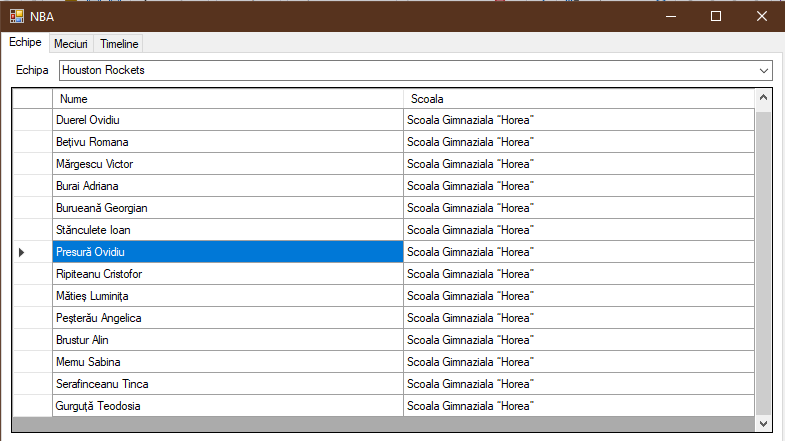
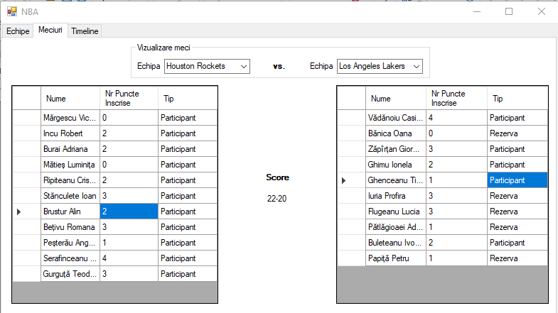
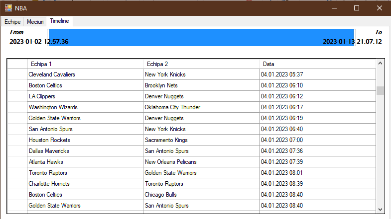

# MAP_LabFacultativC#

## Descriere

<i>
Jr.  NBA  League  Romania  este  o  competitie  mixta  care  se  adreseaza  elevilor  din  clasele  primare  I-IV.Federatia Romana de Baschet, prin Asociatia Judeteana de Baschet Cluj, a primit dreptul de a folosi franciza NBA League si de a organiza, in municipiul Cluj-Napoca, cea de-a doua editie a Jr. NBA League Romania.

Scolile participante si numele echipelor din acest an au fost:

``` 
Scoala Gimnaziala “Horea” -Houston Rockets
Scoala Gimnaziala "Octavian Goga" -Los Angeles Lakers
Liceul Teoretic "Lucian Blaga" -LA Clippers
Scoala Gimnaziala "Ioan Bob" -Chicago Bulls
Scoala Gimnaziala "Ion Creanga" -Cleveland CavaliersColegiul National Pedagogic "Gheorghe Lazar" -UtahJazz
Scoala Gimnaziala Internationala SPECTRUM -Brooklyn NetsColegiul National „Emil Racovita” -New Orleans Pelicans
Colegiul National "George Cosbuc" -Indiana Pacers
Scoala Gimnaziala "Ion Agarbiceanu" -Toronto Raptors
Liceul Teoretic "Avram Iancu" -Charlotte Hornets
Scoala Gimnaziala "Constantin Brancusi" -Phoenix Suns
Liceul Teoretic "Onisifor Ghibu" -Portland TrailBlazers
Liceul Teoretic "Onisifor Ghibu" -Golden State Warriors
Liceul cu Program Sportiv Cluj-Napoca -Washington Wizards
Liceul Teoretic "Nicolae Balcescu" -San Antonio Spurs
Liceul Teoretic "Gheorghe Sincai" -Orlando Magic
Scoala "Nicolae Titulescu" -Denver Nuggets
Scoala Gimnaziala "Liviu Rebreanu" -Detroit Pistons
Scoala Gimnaziala "Iuliu Hatieganu" -Atlanta Hawks
Liceul Teoretic "Bathory Istvan" -Dallas MavericksColegiul National "George Baritiu" -Sacramento Kings
Liceul Teoretic "Apaczai Csere Janos" -Oklahoma City ThunderSeminarul Teologic Ortodox -Boston Celtics
Liceul de Informatica "Tiberiu Popoviciu" -New York Knicks
Scoala Gimnaziala „Alexandru Vaida –Voevod" -Minnesota Timberwolves
Liceul Teoretic ELF -Miami Heat
Scoala Gimnaziala "Gheorghe Sincai" Floresti -Milwaukee Bucks
```

Fiecare scoala afost reprezentata de15 elevi, apartinand uneia dintre echipele mai sus mentionate. La un anumit meci, unii elevi au participat ca rezerva, altii au jucat la meci, iar altii nu au participat deloc.

Se vor definit urmatoarele entitati:

-Echipa(id, nume), unde nume este unul dintre cele evidentiate cu galben in lista de mai sus.

-Elev(id, nume, scoala), scoala va fi una dintre cele mentionate mai sus, iar numele elevului il veti genera voi. Altfel spus, porniti cu cateva scoli si pt fiecare inventati 15 nume de elevi. Apoi mai adaugati echipe.

-Jucator(echipa) si extinde clasa Elev

-Meci(Echipa, Echipa, Data)-JucatorActiv:idJucator, idMeci, nrPuncteInscrise, tip:Rezerva, Partipicant 

### A.Cerințe funționale:

Avand datele despre echipe, jucatori, meciuri si jucatori activi se cere:

- Sa se afiseze toti jucatorii unei echipe dată

- Sa se afiseze toti jucatorii activi ai unei echipe de la un anumit meci

- Sa se afiseze toate meciurile dintr-o anumita perioada calendaristica

- Sa se determine si sa se afiseze scorul de la un anumit meci 

### B.Cerințe non-funționale:

- Arhitectură Stratificată

- Persistenta datelor: la alegere fisiere text sau baze de date(vezi cursul de BD)

- IRepository<ID,E> interfata generica de la temele de Java, definita in c#-Generics, Delegates, LINQ

</i>


## Screenshots

<p align="center">
    </img>
</p>

<p align="center">
    </img>
</p>

<p align="center">
    </img>
</p>
