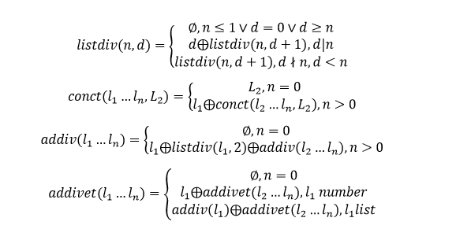

```13.
a) Sa se adauge dupa fiecare element dintr-o lista divizorii elementului.
b) Se da o lista eterogena, formata din numere intregi si liste de numere
intregi. Se cere ca in fiecare sublista sa se adauge dupa fiecare element
divizorii elementului. De ex:

[1, [2, 5, 7], 4, 5, [1, 4], 3, 2, [6, 2, 1], 4, [7, 2, 8, 1], 2] =>

[1, [2, 5, 7], 4, 5, [1, 4, 2], 3, 2, [6, 2, 3, 2, 1], 4, [7, 2, 8, 2, 4, 1], 2]
```

<p align="center">
	</img>
</p>