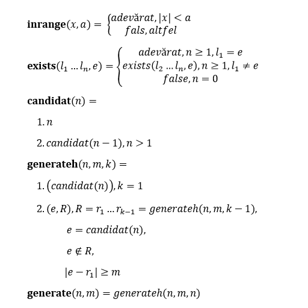

4. Se dau doua numere naturale n si m. Se cere sa se afiseze in toate modurile
posibile toate numerele de la 1 la n, astfel incat intre orice doua numere
afisate pe pozitii consecutive, diferenta in modul sa fie >=m.

    </img>

