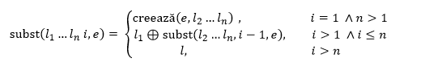
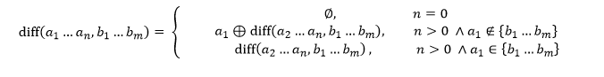

# PLF_Lab1

## R1

```
3. a. Să se substituie al i-lea element dintr-o listă.
   b. Să se determine diferența a două mulțimi reprezentate sub formă de listă.
```

### 3.a.
<p align="center">
   </img>
</p>

### 3.b.

<p align="center">
   </img>
</p>