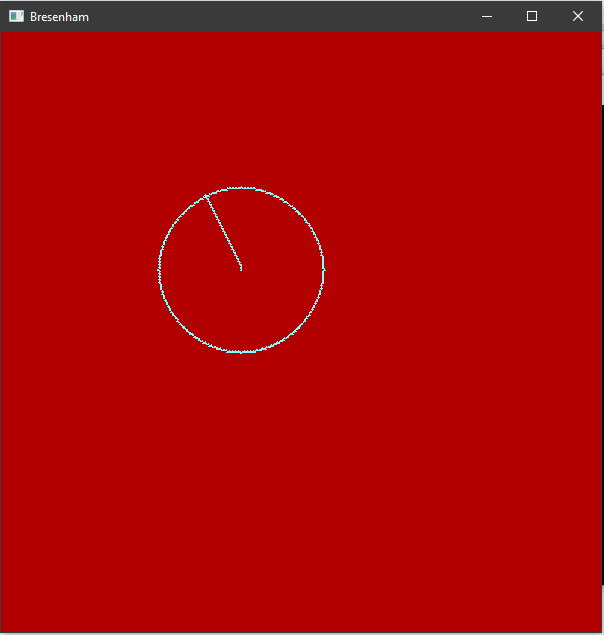

# GC Lab 1

Realizați o aplicațe simplă ce deschide o fereastră si o colorează în roșu. Desenați o dreaptă si un cerc în această fereastră folosind algoritmul lui Bresenham (fie in opengl fie făcând un fișier de tip bmp(sau jpg, png, etc).

