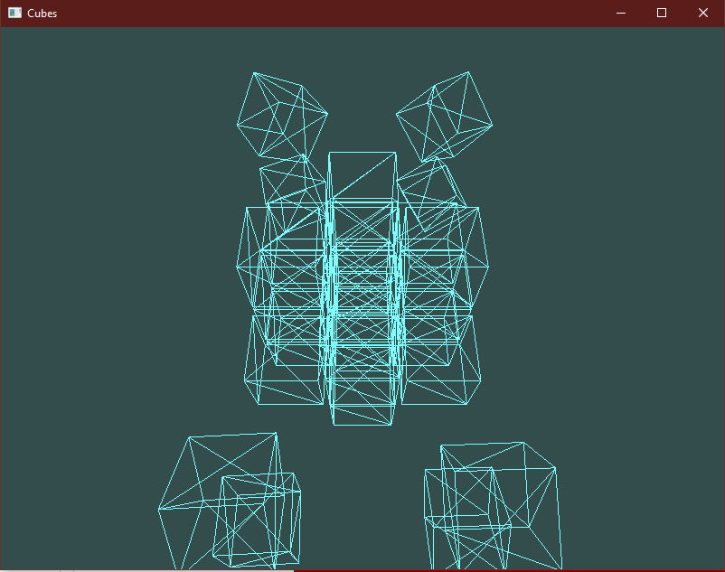

# GC Lab 2

Refceți codul din exemplu astfel încat să aveți posibilitatea de a afișa mai mult de un singur cub.
Cu alte cuvinte trebuie facută o funcție separată de creare a modelului, una de creare a bufferelor pentru
un model, și una de afișare a modelului salvat în bufferele respective ținând cont de poziția camerei și de
mărimea+rotația+poziția obiectului modelat.
După această reorganizare a codului, cubul modelat se poate afișa de mai multe ori de mărimi și dimensiuni diferite la diverse locații pe scenă.

    

