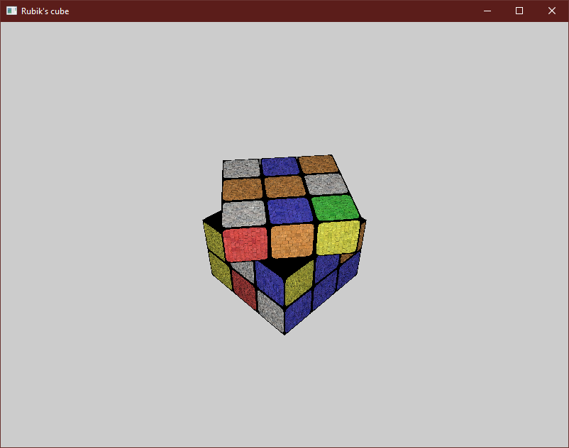

# GC - Lab5 (Proiect)

Realizati un cub Rubik. 

Barem:
- din oficiu - 1p
- modelarea unui obiect care arata ca un cub rubik - 1p
- modelarea obiectului cu meshuri individuale pe fiecare componenta  - 1p
- aplicarea de texturi colorate pe cuburi -1p
- aplicarea unei surse de lumina punctuala in scena - 1p
- existenta unei lumini ambientale sau alte modelari de lumina - 1p
- manipularea obiectului per ansamblu din tastatura - 1p
- manipularea fetelor (rotirea fetelor) - 2p 
- aspect general -1p

    

